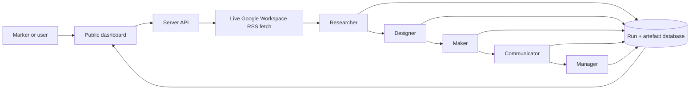

# Architecture and Traceability Design

The system deliberately separates a public dashboard from server-side intelligence. The browser requests typed API procedures only; the five LLM calls and the live Google Workspace RSS query occur in server code. Thus, the client bundle has no model or provider credential, and no secret is committed to the repository.

Each of the five persisted handoff artefacts contains the required `run_id`, `agent_name`, `input_artifact_ids`, `source_evidence`, `assumptions`, `decision_rationale`, `output`, `quality_checks`, and `created_at` fields. The `run_id` is minted before execution begins, displayed in the dashboard, and used to poll live progress while a sequential run is underway.

The public GitHub Pages interface is intended to call the protected server endpoint; the complete server and client source are retained together so the code zip demonstrates dynamic access, secret separation, and the full orchestration logic. Deployment guidance in the README will describe configuration of the server URL without embedding it in the source.
